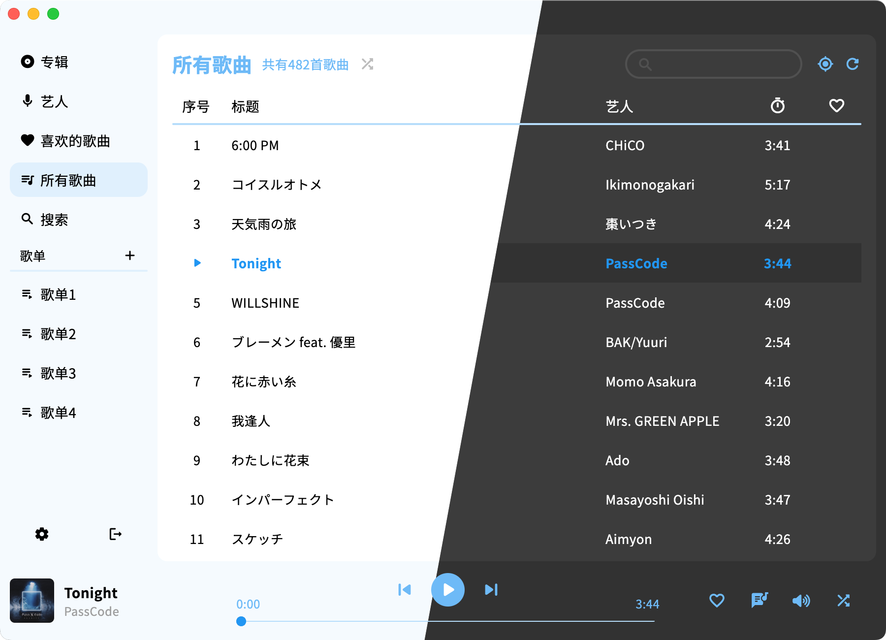

# netPlayer Next版本

Also available  in English. Click [HERE](/documents/en.md) to see document of English version

## 简介


这是一个基于Subsonic (Navidrome) API的一个桌面端App，你可以[**点击这里**](https://www.navidrome.org/docs/installation/)查看如何使用Navidrome (推荐) 搭建一个音乐服务器。

在使用前务必确保运行netPlayer的设备可以通过网络连接到你的音乐服务器

**★ netPlayer Next** | [**netPlayer**](https://github.com/Zhoucheng133/net-player) | [**netPlayer Mobile**](https://github.com/Zhoucheng133/netPlayer-Mobile)

> [!NOTE]
> 这是netPlayer的Flutter版本，本仓库发布的netPlayer版本从2.0.0开始

>[!WARNING]
> 这个版本的netPlayer不兼容Windows 7系统，如果你要查找支持Windows 7版本的netPlayer，转至[netPlayer](https://github.com/Zhoucheng133/net-player)查找v1版本的netPlayer

桌面歌词组件[在这里](https://github.com/Zhoucheng133/netPlayer-mini-kit)

||v1|v2|v3|
|-|-|-|-|
|支持Windows版本|Windows7~|Windows10~|Windows10~|
|框架|Electron|Flutter|Flutter
|支持macOS|✅|✅|✅|
|单曲循环|❌|✅|✅|
|定位歌曲|❌|✅|✅|
|全局快捷键|仅macOS|✅|✅|
|WebSocket服务|❌|❌|✅|
|多语言支持|❌|❌|✅**|

\** 多语言从**v3.2.0** 版本开始支持多语言，你[**点击这里**](#多语言支持)查看详细的语言支持

> [!NOTE]
> 受限于Subsonic API，“所有歌曲”和“专辑”只能显示500首/张（随机的500首歌曲排序展示）

> [!TIP]
> 在所有歌曲页面歌曲数量的右侧有完全随机播放按钮，这个功能不受歌曲数量限制

## 目录

- [简介](#简介)
- [使用](#使用)
- [截图](#截图)
- [多语言支持](#多语言支持)
- [WebSocket服务](#websocket服务)
- [常见问题](#常见问题)
- [其它链接](#其它链接)
- [在你的设备上配置netPlayer Next](#在你的设备上配置netplayer-next)
- [更新日志](#更新日志)
- [一些API](#一些api)

## 使用

### 快捷键

#### App内快捷键
- `空格`：播放/暂停
- `command →`(macOS)或`Ctrl →`(Windows)：下一首
- `command ←`(macOS)或`Ctrl ←`(Windows)：上一首
- `command L`(macOS)或`Ctrl L`(Windows)：显示/隐藏歌词

#### 全局快捷键
- ⏯️(macOS & Windows)或`Ctrl Alt 空格`(Windows)：播放/暂停
- ⏩(macOS & Windows)或`Ctrl Alt →`(Windows)：下一首
- ⏪(macOS & Windows)或`Ctrl Alt ←`(Windows)：上一首

## 截图

### 主界面




### 桌面歌词组件

> [!NOTE]
> 歌词组件的代码[在这里](https://github.com/Zhoucheng133/netPlayer-mini-kit)，你可以在Release页中下载没有这个功能的版本，桌面歌词的开关在`设置-启用歌词组件`，**打开这个功能需要启用ws服务**


## 多语言支持

- 简体中文
- 繁体中文 (由ChatGPT翻译)
- 英语

你可以通过pull&request添加你所需要的语言。语言目录位于`lib/lang`

如果有一些翻译不那么准确，你可以添加一个Issue

## WebSocket服务
>[!NOTE]
> 这个功能至少需要**v3.0.0**版本，下面的接口适用的版本为**v3.3.0**或更新的版本，如果你想要查看过去版本的接口，你可以查找以往版本Tag的README文档

### 发送的消息

```json
{
  "title": <标题>,
  "artist": <艺人>,
  "lyric": <当前歌词>,
  "cover": <专辑封面链接>,
  "fullLyric": <完整歌词>,
  "line": <当前歌词进行到多少行>,
  "isPlay": <是否正在播放>,
  "mode": <播放模式>,
}
```

### 接收的消息

详细的见`lib/views/functions/ws.dart`内容

```json
{
  "command": <操作>
  "data": <数据>
}
```

WebSocket服务器默认地址为: `localhost:9098`

这个功能可以二次开发，用于直播背景音乐信息显示，详细步骤如下：
1. 设计一个Web页面用于直播（边框）
2. 在你觉得合适的地方设计一个背景音乐信息显示，内容为WebSocket服务获取的信息

## 常见问题
### 无法连接到音乐服务器:
>你需要先检查你的客户端设备是否可以直接打开音乐库网页，很大概率是服务器防火墙或者设置问题  
另外务必检查地址，http和https
### 所有歌曲显示不全: 
>Subsonic音乐库的API并不支持查看所有的歌曲，因此至多只能显示500首歌曲
但是你可以通过完全随机播放来随机播放所有的歌曲，不受歌曲数量显示，v2版本在左边栏，v3版本在所有歌曲页标题右侧
### 打开页面灰色方块或者崩溃不显示内容
> 可能老版本的netPlayer Next和新版本冲突  
解决办法为删除这两个目录:  
C:\Users\<你的用户名>\AppData\Roaming\zhouc\net_player_next  
C:\Users\<你的用户名>\AppData\Roaming\zhouc\netPlayer
### 没有找到歌词:
>歌词API见文末，没有找到歌词就是字面意思  
歌词的内容取决于歌曲标题、所属专辑、艺人和歌曲长度
   

## 其它链接

- [spotify-downloader](https://github.com/spotDL/spotify-downloader)用于下载歌曲，通过这种方式下载的歌曲一般会包含一些信息
- [Live-BG](https://github.com/Zhoucheng133/Live-BG)用于直播的配合netPlayer显示当前播放歌曲信息和歌词的背景
- [netPlayer-mini-kit](https://github.com/Zhoucheng133/netPlayer-mini-kit)桌面歌词系统

## 在你的设备上配置netPlayer Next

### netPlayer Next本体

本项目使用Flutter 3.24开发，你可以直接使用这个版本的Flutter在你的设备上Debug  
建议直接使用Visual Studio Code，在安装完Flutter扩展和Dart扩展之后就可以Debug/Profile/Release了，我已经在.vscode文件夹中添加了launch类型

> [!WARNING]
> 不要使用Flutter3.7或更低版本的Flutter，确保Dart版本至少有3.0.0

如果你在**Windows**上Debug或者Release，注意不要在国内的网络环境下操作，可能会等非常长的时间，Mac上没有这个问题

在Windows上的打包：
```bash
flutter build windows
```

在macOS上打包：
```bash
flutter build macos
```

## 关于PR
> [!NOTE]
> 如果你有需要PR，请将目标函数选择dev分支而不是主分支

本项目中不乏很多屎山代码（是的，虽然基本上我是唯一的开发者），但是如果不能确保不影响正常的功能请保持现状

我尝试修改了一部分，但是有一些部分对整个项目影响过大然后崩溃了;w;

### 桌面歌词组件

你需要前往[netPlayer-mini-kit](https://github.com/Zhoucheng133/netPlayer-mini-kit)页面中以同样的方法打包，放置到`<程序路径>/lyric`下即可

## 一些API

[Subsonic API](http://www.subsonic.org/pages/api.jsp)

[lrclib API](https://lrclib.net/docs)

网易云音乐