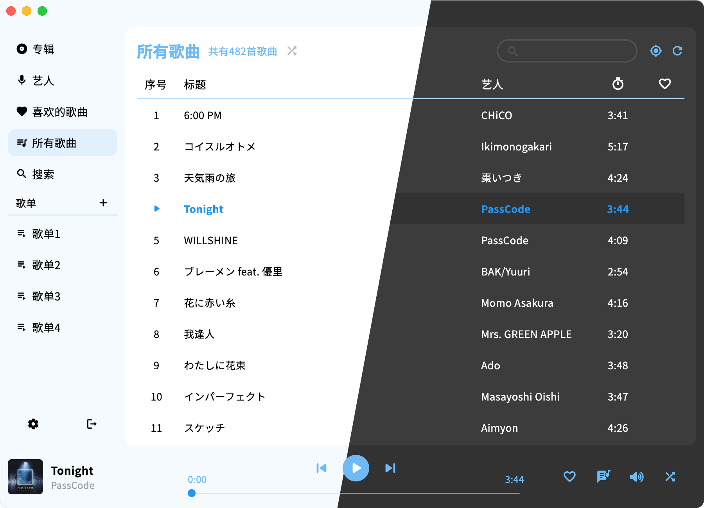
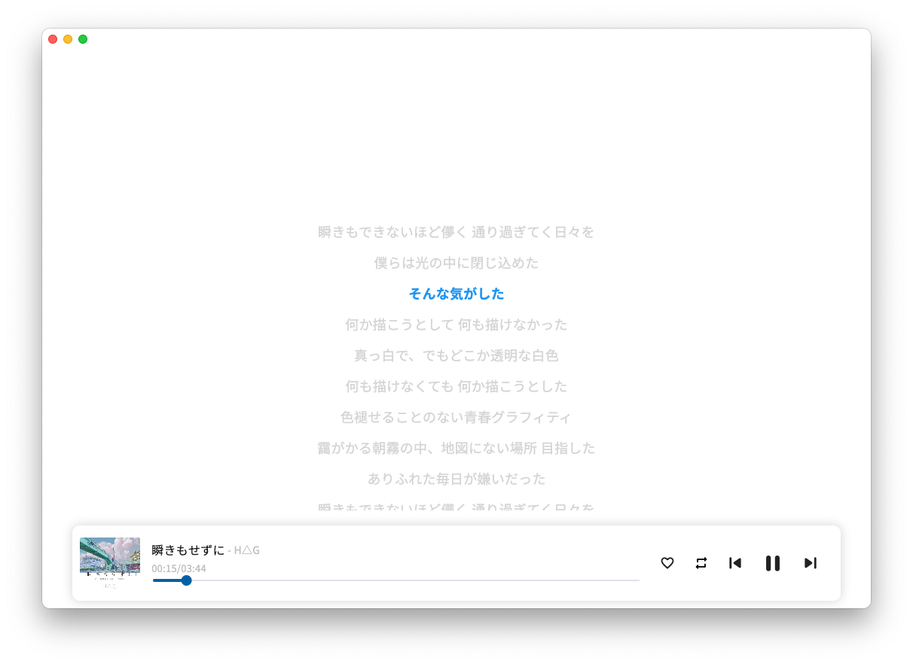
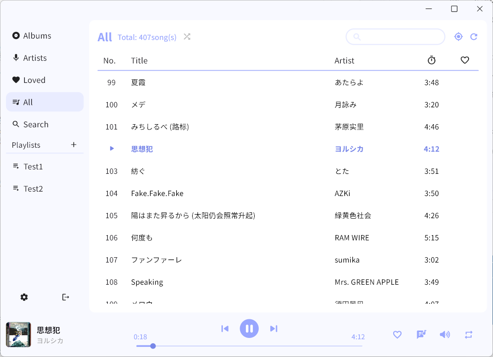

❌这个分支被遗弃，不要使用这个分支!

# netPlayer Next版本

## 简介


**★ netPlayer Next** | [**netPlayer**](https://github.com/Zhoucheng133/net-player) | [**netPlayer Mobile**](https://github.com/Zhoucheng133/netPlayer-Mobile)

**注意，这是[netPlayer](https://github.com/Zhoucheng133/net-player)的Flutter版本**  
版本号在标准版netPlayer之后，本仓库的netPlayer版本号从`2.0.0`开始

||v1|v2|v3|
|-|-|-|-|
|支持Windows版本|Windows7~|Windows10~|Windows10~|
|支持macOS|✅|✅|✅*|
|单曲循环|❌|✅|✅|
|定位歌曲|❌|✅|✅|
|全局快捷键|仅macOS|✅|✅|
|WebSocket服务|❌|❌|✅|

\* 由于本人换电脑，macOS没法打包，如果你有需要可以在自己的设备上打包v3版本(所以也不清楚macOS版本的运行情况，欢迎给予反馈!)

## 快捷键

### App内快捷键
- `空格`：播放/暂停
- `command →`(macOS)或`Ctrl →`(Windows)：下一首
- `command ←`(macOS)或`Ctrl ←`(Windows)：上一首
- `command L`(macOS)或`Ctrl L`(Windows)：显示/隐藏歌词

### 全局快捷键
- `F8`<sup>*</sup>(macOS)或`Ctrl Alt 空格`(Windows)：播放/暂停
- `F7`<sup>*</sup>(macOS)或`Ctrl Alt →`(Windows)：下一首
- `F9`<sup>*</sup>(macOS)或`Ctrl Alt ←`(Windows)：上一首

<sup>*</sup>系统媒体控制，不需要`Fn`键

## 截图





## WebSocket服务

**这个功能至少需要v3.0.0**

在**设置**中启用ws服务之后，netPlayer将会作为一个本地的WebSocket服务器，在播放歌曲更新/歌词更新的时候向客户端发送消息，消息的内容格式为
```
歌曲标题
艺人
歌词
```



WebSocket服务器地址为: `localhost:9098`

这个功能可以二次开发，用于直播背景音乐信息显示，详细步骤如下：
1. 设计一个Web页面用于直播（边框）
2. 在你觉得合适的地方设计一个背景音乐信息显示，内容为WebSocket服务获取的信息

我也会在之后开发一个样板

## 在你的设备上配置netPlayer Next

本项目使用lutter^3.22开发，你可以直接使用这个版本的Flutter在你的设备上Debug  
建议直接使用Visual Studio Code，在安装完Flutter扩展和Dart扩展之后就可以Debug/Profile/Release了，我已经在.vscode文件夹中添加了launch类型

不要使用Flutter3.7或更低版本的Flutter，确保Dart版本至少有3.0.0

## 更新日志

### 3.0.0 (2024/6/20)
- 重构了整个软件，现在看起来更加美观
- 大幅提高了运行效率
- 添加了音量调节功能
- 添加了歌曲界面艺人显示
- 现在搜索不区分大小写了
- 改进了搜索逻辑
- 修复软件信息在Windows下的显示问题
- 修复歌单为0时添加歌单崩溃的问题
- 修复歌单发生变化时的定位问题

<details>
<summary>过去的版本</summary>

### 2.0.7 (2024/5/12) 【仅对Windows版本的更新】
- 添加全局快捷键
- 添加是否添加全局快捷键的开关

### 2.0.6 (2024/3/28)
- 添加显示/隐藏歌词的快捷键
- 添加Windows上切换歌曲的快捷键
- 修复macOS系统上点击菜单无效的问题

### 2.0.5 (2024/3/18)
- 添加了托盘功能和Windows上的关闭隐藏窗口的功能
- 修复没有登录时歌曲操作的问题

### 2.0.4 (补充更新) (2024/3/10)
- 添加清理封面图片缓存的功能(macOS系统)
- 添加在Windows上Debug的配置开发条件

### 2.0.4 (2024/3/9)
- ~~现在可以复制一些文本~~
- 修复没有进入歌词第一句时的滚动状态问题
- 修复无法在文本框输入空格的问题
- 本地化一些系统控件语言

### 2.0.3 (2024/3/7)
- 修复歌词滚动问题
- 修复macOS语言问题
- 修复macOS从菜单切换页面的问题

### 2.0.2 (2024/3/6)
- 统一Windows和macOS一些组件
- 修复运行在Windows系统上稳定性的问题
- 修复进度条崩溃的问题
- 提高了程序运行效率

### 2.0.1 (2024/2/28)
- 恢复全局搜索功能
- 恢复检查更新功能
- 恢复歌词显示功能
- 修复窗口没有聚焦的问题
- 修复播放栏信息显示问题
- 修复播放栏封面图片圆角问题
- 修复定位图标是否可用没有区分的问题
- 修复Windows上窗口按钮图标错误的问题

### 2.0.0 Beta (2024/2/26)
- 使用Flutter重构了整个项目
- 添加单曲循环播放模式
- 添加记住播放模式功能
- 添加了歌曲项中右键菜单
- 改进歌曲显示的布局
- 改进滚动到播放歌曲
- 🚫全局搜索功能暂时无法使用
- 🚫检查更新功能暂时无法使用
- 🚫Windows版隐藏到状态栏暂时无法使用
- 🚫歌词功能暂时无法使用
</details>

## 一些API

[Subsonic API](http://www.subsonic.org/pages/api.jsp)

[lrclib API](https://lrclib.net/docs)