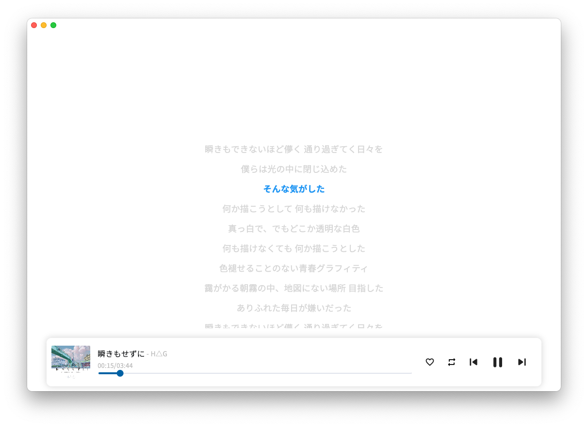
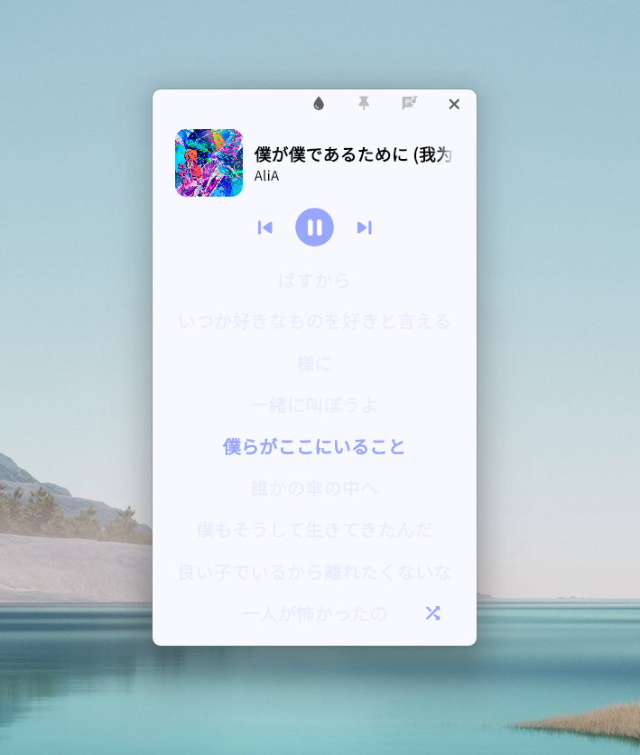
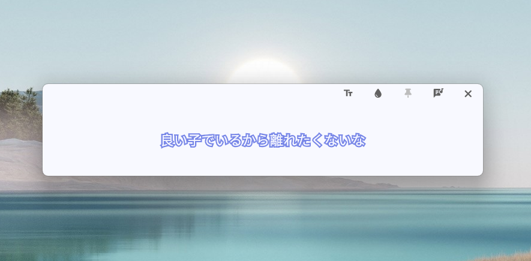

# netPlayer Next

你可以[点击这里](../README.md)查看中文文档

## Intro


**★ netPlayer Next** | [**netPlayer**](https://github.com/Zhoucheng133/net-player) | [**netPlayer Mobile**](https://github.com/Zhoucheng133/netPlayer-Mobile)

> [!NOTE]
> Notice: This is netPlayer Flutter version starts from v2.0.0

> [!WARNING]
> This version of netPlayer does NOT support Windows 7. If you need netPlayer on Windows7, you should find [v1 netPlayer](https://github.com/Zhoucheng133/net-player)

Desktop Lyric Kit [is here](https://github.com/Zhoucheng133/netPlayer-mini-kit)

||v1|v2|v3|
|-|-|-|-|
|Supported Windows versions|Windows7~|Windows10~|Windows10~|
|Framwork|Electron|Flutter|Flutter
|Support macOS|✅|✅|✅|
|Single play|❌|✅|✅|
|Locate song played|❌|✅|✅|
|Global shortcuts|macOS only|✅|✅|
|Websocket|❌|❌|✅|
|Multi language support|❌|❌|✅**|


\*\* From **v3.2.0**, You can see the detail of multi language support at [**Language support**](#language-support). Other version support Simplified Chinese only.

> [!NOTE]
> Subsonic API does NOT support get 500 songs. All songs you can see is get random 500 songs and sort by time.

> [!TIP]
> You can use full random play button next to song number on all songs page, which is not affected by restrictions of Subsonic API

## Contents

- [Intro](#intro)
- [Usage](#usage)
- [Screenshot](#screenshot)
- [Language support](#language-support)
- [WebSocket service](#websocket-service)
- [FAQ](#faq)
- [Other links](#other-links)
- [Config netPlayer Next on your own device](#config-netplayer-next-on-your-own-device)
- [Update log](#update-log)
- [Some APIs](#some-apis)


## Usage
This is a Subsonic (Navidrome) API based desktop App. You can [click here](https://www.navidrome.org/docs/installation/) to see how to create a music server with Navidrome (Recommend).

Make sure your device running netPlayer can connect to your music server.

### Shortcuts

#### Shortcuts in app
- `Space`：Play/Pause
- `command →`(macOS) or `Ctrl →`(Windows)：Next song
- `command ←`(macOS) or `Ctrl ←`(Windows)：Previous song
- `command L`(macOS) or `Ctrl L`(Windows)：Show/Hide lyrics

#### Global shortcuts
- ⏯️(macOS & Windows) or `Ctrl Alt Space`(Windows)：Play/Pause
- ⏩(macOS & Windows) or `Ctrl Alt →`(Windows)：Next song
- ⏪(macOS & Windows) or `Ctrl Alt ←`(Windows)：Previous song

## Screenshot




### Desktop lyric kit

> [!NOTE]
> Desktop lyric kit's code [is here](https://github.com/Zhoucheng133/netPlayer-mini-kit). You can download netPlayer without this feature on Relase page. You can enable it on `Settings - Enable lyric kit`. You need to enable ws service before using it.





## Language support

- Simplified Chinese
- Traditional Chinese (Translated by ChatGPT)
- English (Translated by myself)

You can add your language with pull&request. Here is the language directory: `lib/lang`

If some translate is not accurate, you can add a issue.

## WebSocket service
> [!NOTE]
> This function needs v3.0.0 or later

If you open ws service on **settings**, netPlayer will be a WebSocket server, and it will send messages when lyric update or play song update. The message will be like:

### Send message

```json
{
  "title": <song title>,
  "artist": <song artist>,
  "lyric": <lyric now>,
  "cover": <cover image link>,
  "fullLyric": <full lyric>,
  "line": <line of lyric now>,
  "isPlay": <now playing or not>,
  "mode": <play mode>,
}
```

### Receive message

More details see `lib/views/functions/ws.dart`

```json
{
  "command": <command>
  "data": <data attached>
}
```

Default port of WebSocket server is: `localhost:9098`.

This function can be used for live streaming to display bgm information. You can develop your own live streaming background as follows:
1. Design a web background for your stream.
2. Find a place to display bgm information, and get it through WebSocket service.

## FAQ

### Cannot connect to server
>You need to check whether your cilent device can access to your server. It probably that firewall of your server system blocked your access. Make sure your URL is avaliable (Be aware http and https).
### Not all songs displayed
>Subsonic API does not support to display all the songs. The limit of songs to get is 500.  
But you can shuffle all the songs through "Shuffle all the songs", which is not affect by songs displayed. You can see this button right of the "All" page title.
### See gray block or crashed
>Maybe old version of netPlayer affect  
Delete these directory:   
C:\Users\<your username>\AppData\Roaming\zhouc\net_player_next  
C:\Users\<your username>\AppData\Roaming\zhouc\netPlayer  
### No lyrics found:
>You can see lyrics API at the end of this page. It just what it says.  
Lyrics depends on the song's title, album, artist and duration.
   

## Other links

- [spotify-downloader](https://github.com/spotDL/spotify-downloader) For download songs. It contains songs' informations.
- [Live-BG](https://github.com/Zhoucheng133/Live-BG) Used for live streaming to display bgm information developed by myself.
- [netPlayer-mini-kit](https://github.com/Zhoucheng133/netPlayer-mini-kit)Desktop lyric kit
  
## Config netPlayer Next on your own device

### netPlayer Next only

This project is developed with Flutter 3.24. You can debug with it directly.
Recommand using Visual Studio Code. After installing Flutter and Dart extension on Visual Studio Code, you can debug/profile/relese on your device.

> [!WARNING]
> Do NOT use Flutter^3.7 or lower version of Flutter. Make sure your Dart version is higher than 3.0.0

If you Debug or Release on **Windows**, make sure not do it in Chinese mainland network environment.

### With desktop lyric kit

Use the same way to pacakge [netPlayer-mini-kit](https://github.com/Zhoucheng133/netPlayer-mini-kit), and move it to `<netPlayer program path>/lyric`

Build on Windows：
```bash
flutter build windows
```

Build on Mac: 
```bash
flutter build macos
```

I have not tried it on Linux. You can try it by yourself.

## Update log

### 3.4.1 (2024/12/26)
- Add change language dialog
- Added translation for the macOS system menu
- Fix system control not work on macOS
- Fix toggle lyric shortcut not work on macOS
- Fix some menu items not work on macOS
- Fix progress seek not work using control center on macOS

<details>
<summary>Previous version (Not fully translated yet)</summary>

### 3.4.0 (2024/12/24)
- Avaliable for macOS
- Fix crash when get cover image
- Fix a bug
- Improve preformance

### 3.3.8 (2024/12/20)
- Fix lyric not scroll when seeking

### 3.3.7 (2024/12/5)
- Add auto scrolling when resize window
- Improve input field of ws service port
- Imporve a translation

### 3.3.6 (2024/12/2)
- Fix duplicate request for lyric
- Update desktop lyric kit (Detail:  [v0.1.1](https://github.com/Zhoucheng133/netPlayer-mini-kit/releases/tag/v0.1.1))

### 3.3.5 (2024/11/16)
- Add license page
- Fix the issue with the lyric highlighting
- Fix the issue where the last line of the lyrics is missing

### 3.3.4 (2024/11/14)
- Improve lyrics matching

### 3.3.3 (2024/11/5)
- Improve lyrics matching

### 3.3.2 (2024/10/13)
- Fix saved volume not apply after restart ([#3](https://github.com/Zhoucheng133/netPlayer-Next/issues/3))

### 3.3.1 (2024/10/12)
- Add resize lyric font feature

### 3.3.0 (2024/9/28)
- Add media control with ws service
- Add desktop lyric kit
- Fix status error when stop play
- Fix some undestroyed listener

### 3.2.4 (2024/9/19)
- Add hint text on renaming playlist
- Add auto detect system language
- Add getting artist/album on lyric page
- Fix an issue when close ws service

### 3.2.3 (2024/8/30)
- Add lyric from netease music
- Fix display issue of playlist' name
- Fix may crash when getting lyric

### 3.2.2 (2024/8/29)
- Fix missing translations
- Fix a bug of progress slider
- Improve some English translate
- Improve performance

### 3.2.1 (2024/8/6)
- Fix a bug of a dialog
- Fix a bug of logout

### 3.2.0 (2024/8/4)
- Add support for multi language
- Fix some wrong tips
- Improve some animations

### 3.1.5 (2024/7/30)
- 解决Windows下图标模糊的问题

### 3.1.4 (2024/7/29)
- 添加刷新音乐库的功能

### 3.1.3 (2024/7/25)
- 添加一些鼠标移动到图标的提示
- 添加歌曲超出API范围的提示
- 添加本地化支持
- 修复当没有喜欢的歌曲时加载错误

### 3.1.2 (2024/7/21)
- 添加了可以自定义ws服务端口的功能
- 添加了ws服务端口冲突的提示
- 解决了在连接服务器失败卡住的问题
- 解决了ws服务端口冲突崩溃的问题

### 3.1.1 (2024/7/2)
- 解决错误的用户名或者密码登录崩溃的问题

### 3.1.0 (2024/6/28)
- 添加从歌曲跳转到艺人和专辑的菜单
- 添加了Windows的音频控制模块，现在你可以使用Windows上的音频控制了

原有的全局快捷键也可以一样使用

### 3.0.2 (2024/6/25)
- 修复在输入框输入空格触发快捷键的问题

### 3.0.1 (2024/6/21)
- 隐藏了一些无效按钮
- 搜索框自动清空结果

### 3.0.0 (2024/6/20)
- 重构了整个软件，现在看起来更加美观
- 大幅提高了运行效率
- 添加了ws服务功能
- 添加了音量调节功能
- 添加了歌曲界面艺人显示
- 现在搜索不区分大小写了
- 改进了搜索逻辑
- 修复软件信息在Windows下的显示问题
- 修复歌单为0时添加歌单崩溃的问题
- 修复歌单发生变化时的定位问题

### 2.0.7 (2024/5/12) 【仅对Windows版本的更新】
- 添加全局快捷键
- 添加是否添加全局快捷键的开关

### 2.0.6 (2024/3/28)
- 添加显示/隐藏歌词的快捷键
- 添加Windows上切换歌曲的快捷键
- 修复macOS系统上点击菜单无效的问题

### 2.0.5 (2024/3/18)
- 添加了托盘功能和Windows上的关闭隐藏窗口的功能
- 修复没有登录时歌曲操作的问题

### 2.0.4 (补充更新) (2024/3/10)
- 添加清理封面图片缓存的功能(macOS系统)
- 添加在Windows上Debug的配置开发条件

### 2.0.4 (2024/3/9)
- ~~现在可以复制一些文本~~
- 修复没有进入歌词第一句时的滚动状态问题
- 修复无法在文本框输入空格的问题
- 本地化一些系统控件语言

### 2.0.3 (2024/3/7)
- 修复歌词滚动问题
- 修复macOS语言问题
- 修复macOS从菜单切换页面的问题

### 2.0.2 (2024/3/6)
- 统一Windows和macOS一些组件
- 修复运行在Windows系统上稳定性的问题
- 修复进度条崩溃的问题
- 提高了程序运行效率

### 2.0.1 (2024/2/28)
- 恢复全局搜索功能
- 恢复检查更新功能
- 恢复歌词显示功能
- 修复窗口没有聚焦的问题
- 修复播放栏信息显示问题
- 修复播放栏封面图片圆角问题
- 修复定位图标是否可用没有区分的问题
- 修复Windows上窗口按钮图标错误的问题

### 2.0.0 Beta (2024/2/26)
- 使用Flutter重构了整个项目
- 添加单曲循环播放模式
- 添加记住播放模式功能
- 添加了歌曲项中右键菜单
- 改进歌曲显示的布局
- 改进滚动到播放歌曲
- 🚫全局搜索功能暂时无法使用
- 🚫检查更新功能暂时无法使用
- 🚫Windows版隐藏到状态栏暂时无法使用
- 🚫歌词功能暂时无法使用
</details>

## Some APIs

[Subsonic API](http://www.subsonic.org/pages/api.jsp)

[lrclib API](https://lrclib.net/docs)