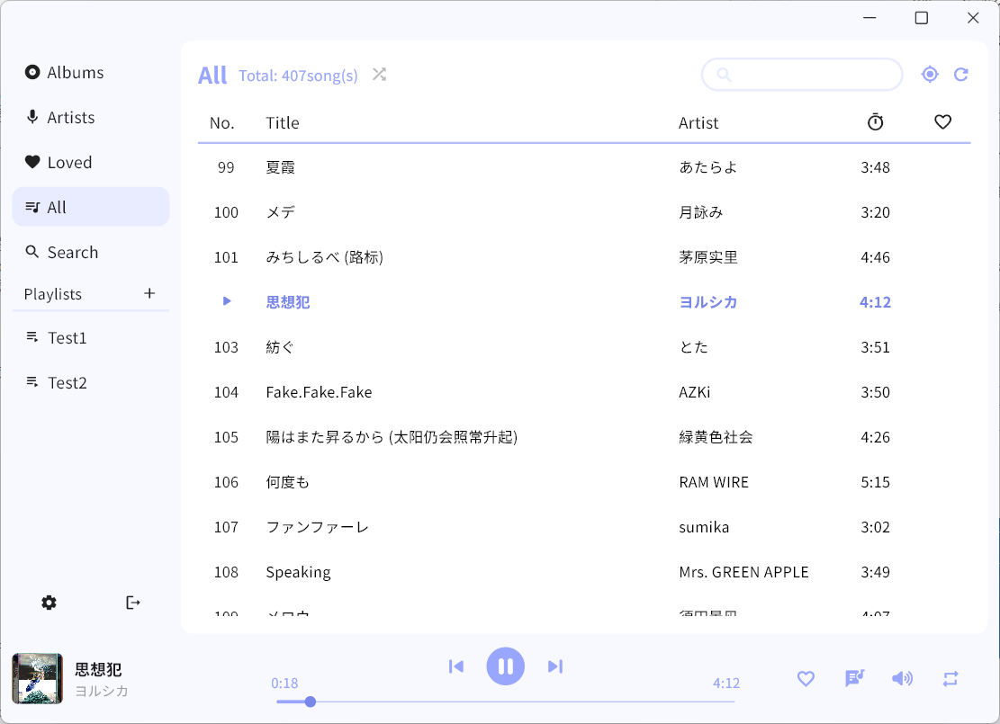

# netPlayer Next

你可以[点击这里](../README.md)查看中文文档

## Intro


**★ netPlayer Next** | [**netPlayer**](https://github.com/Zhoucheng133/net-player) | [**netPlayer Mobile**](https://github.com/Zhoucheng133/netPlayer-Mobile)

**Notice: This is [netPlayer](https://github.com/Zhoucheng133/net-player) Flutter version**  
This version of netPlayer starts from `v2.0.0`

**This version of netPlayer does NOT support Windows 7.**

||v1|v2|v3|
|-|-|-|-|
|Supported Windows versions|Windows7~|Windows10~|Windows10~|
|Framwork|Electron|Flutter|Flutter
|Support macOS|✅|✅|✅*|
|Single play|❌|✅|✅|
|Locate song played|❌|✅|✅|
|Global Shortcuts|macOS only|✅|✅|
|Websocket|❌|❌|✅|
|Multi language support|❌|❌|✅**|


\* Since I switched to Windows PC, I can't build macOS version. If you need it, you can build it on your own Mac (Also I don't know whether it runs ok on Mac. You can give me some feedbacks).

\*\* From **v3.2.0**, You can see the detail of multi language support at [**Language support**](#language-support). Other version support Simplified Chinese only.

## Shortcuts

### Shortcuts in app
- `Space`：Play/Pause
- `command →`(macOS) or `Ctrl →`(Windows)：Next song
- `command ←`(macOS) or `Ctrl ←`(Windows)：Previous song
- `command L`(macOS) or `Ctrl L`(Windows)：Show/Hide lyrics

### Global shortcuts
- ⏯️(macOS & Windows) or `Ctrl Alt Space`(Windows)：Play/Pause
- ⏩(macOS & Windows) or `Ctrl Alt →`(Windows)：Next song
- ⏪(macOS & Windows) or `Ctrl Alt ←`(Windows)：Previous song

## Screenshot




## Language support

- Simplified Chinese
- Traditional Chinese (Translated by ChatGPT)
- English (Translated by myself)

You can add your language with pull&request. Here is the language directory: `lib/lang`

If some translate is not accurate, you can add a issue.

## WebSocket Service

**This function needs v3.0.0 or later**

If you open ws service on **settings**, netPlayer will be a WebSocket server, and it will send messages when lyric update or play song update. The message will be like:

```json
{
  "title": <song title>,
  "artist": <artist>,
  "lyric": <lyric>
}
```

Default port of WebSocket server is: `localhost:9098`.

This function can be used for live streaming to display bgm information. You can develop your own live streaming background as follows:
1. Design a web background for your stream.
2. Find a place to display bgm information, and get it through WebSocket service.

## Commnon problems
1. Cannot connect to server:
   ```
   You need to check whether your cilent device can access to your server. It probably that firewall of your server system blocked your access. And be sure your URL is avaliable (Be aware http and https).
   ```
2. Not all songs displayed: 
   ```
   Subsonic API does not support to display all the songs. The limit of songs to get is 500.
   But you can shuffle all the songs through "Shuffle all the songs", which is not affect by songs displayed. You can see this button right of the "All" page title.
   ```
3. See gray block or crashed
   ```
   Two possibilies: 
   【1】Subsonic (Navidrome) need to get Music information through Music file.
   So if your Music file does not contain information(s) below, netPlayer can't use:
   1. Song title
   2. Song artist
   3. Song duraion
   4. Album
   Tip: Music file without cover doesn't affect netPlayer
   【2】Old version of netPlayer affect
   Delete these directory: 
   C:\Users\<your username>\AppData\Roaming\zhouc\net_player_next
   C:\Users\<your username>\AppData\Roaming\zhouc\netPlayer
   ```
4. No lyrics found:
   ```
   You can see lyrics API at the end of this page. It just what it says.
   Lyrics depends on the song's title, album, artist and duration.
   ```
   

## Other link

- [spotify-downloader](https://github.com/spotDL/spotify-downloader) For download songs. It contains songs' informations.
- [Live-BG](https://github.com/Zhoucheng133/Live-BG) Used for live streaming to display bgm information developed by myself.

## Config netPlayer Next on your own device

This project is developed with Flutter^3.22. You can debug with it directly.
Recommand using Visual Studio Code. After installing Flutter and Dart extension on Visual Studio Code, you can debug/profile/relese on your device.

Do NOT use Flutter^3.7 or lower version of Flutter. Make sure your Flutter version is higher than 3.0.0

If you Debug or Release on **Windows**, make sure not do it in Chinese mainland network environment.

Build on Windows：
```bash
flutter build windows
```

Build on Mac: 
```bash
flutter build macos
```

I have not tried it on Linux. You can try it by yourself.

## Update log

### 3.2.1
- Fix missing translations
- Improve some English translate

<details>
<summary>Previous version (Not fully translated yet)</summary>

### 3.2.1 (2024/8/6)
- Fix a bug of a dialog
- Fix a bug of logout

### 3.2.0 (2024/8/4)
- Add support for multi language
- Fix some wrong tips
- Improve some animations

### 3.1.5 (2024/7/30)
- 解决Windows下图标模糊的问题

### 3.1.4 (2024/7/29)
- 添加刷新音乐库的功能

### 3.1.3 (2024/7/25)
- 添加一些鼠标移动到图标的提示
- 添加歌曲超出API范围的提示
- 添加本地化支持
- 修复当没有喜欢的歌曲时加载错误

### 3.1.2 (2024/7/21)
- 添加了可以自定义ws服务端口的功能
- 添加了ws服务端口冲突的提示
- 解决了在连接服务器失败卡住的问题
- 解决了ws服务端口冲突崩溃的问题

### 3.1.1 (2024/7/2)
- 解决错误的用户名或者密码登录崩溃的问题

### 3.1.0 (2024/6/28)
- 添加从歌曲跳转到艺人和专辑的菜单
- 添加了Windows的音频控制模块，现在你可以使用Windows上的音频控制了

原有的全局快捷键也可以一样使用

### 3.0.2 (2024/6/25)
- 修复在输入框输入空格触发快捷键的问题

### 3.0.1 (2024/6/21)
- 隐藏了一些无效按钮
- 搜索框自动清空结果

### 3.0.0 (2024/6/20)
- 重构了整个软件，现在看起来更加美观
- 大幅提高了运行效率
- 添加了ws服务功能
- 添加了音量调节功能
- 添加了歌曲界面艺人显示
- 现在搜索不区分大小写了
- 改进了搜索逻辑
- 修复软件信息在Windows下的显示问题
- 修复歌单为0时添加歌单崩溃的问题
- 修复歌单发生变化时的定位问题

### 2.0.7 (2024/5/12) 【仅对Windows版本的更新】
- 添加全局快捷键
- 添加是否添加全局快捷键的开关

### 2.0.6 (2024/3/28)
- 添加显示/隐藏歌词的快捷键
- 添加Windows上切换歌曲的快捷键
- 修复macOS系统上点击菜单无效的问题

### 2.0.5 (2024/3/18)
- 添加了托盘功能和Windows上的关闭隐藏窗口的功能
- 修复没有登录时歌曲操作的问题

### 2.0.4 (补充更新) (2024/3/10)
- 添加清理封面图片缓存的功能(macOS系统)
- 添加在Windows上Debug的配置开发条件

### 2.0.4 (2024/3/9)
- ~~现在可以复制一些文本~~
- 修复没有进入歌词第一句时的滚动状态问题
- 修复无法在文本框输入空格的问题
- 本地化一些系统控件语言

### 2.0.3 (2024/3/7)
- 修复歌词滚动问题
- 修复macOS语言问题
- 修复macOS从菜单切换页面的问题

### 2.0.2 (2024/3/6)
- 统一Windows和macOS一些组件
- 修复运行在Windows系统上稳定性的问题
- 修复进度条崩溃的问题
- 提高了程序运行效率

### 2.0.1 (2024/2/28)
- 恢复全局搜索功能
- 恢复检查更新功能
- 恢复歌词显示功能
- 修复窗口没有聚焦的问题
- 修复播放栏信息显示问题
- 修复播放栏封面图片圆角问题
- 修复定位图标是否可用没有区分的问题
- 修复Windows上窗口按钮图标错误的问题

### 2.0.0 Beta (2024/2/26)
- 使用Flutter重构了整个项目
- 添加单曲循环播放模式
- 添加记住播放模式功能
- 添加了歌曲项中右键菜单
- 改进歌曲显示的布局
- 改进滚动到播放歌曲
- 🚫全局搜索功能暂时无法使用
- 🚫检查更新功能暂时无法使用
- 🚫Windows版隐藏到状态栏暂时无法使用
- 🚫歌词功能暂时无法使用
</details>

## Some API

[Subsonic API](http://www.subsonic.org/pages/api.jsp)

[lrclib API](https://lrclib.net/docs)