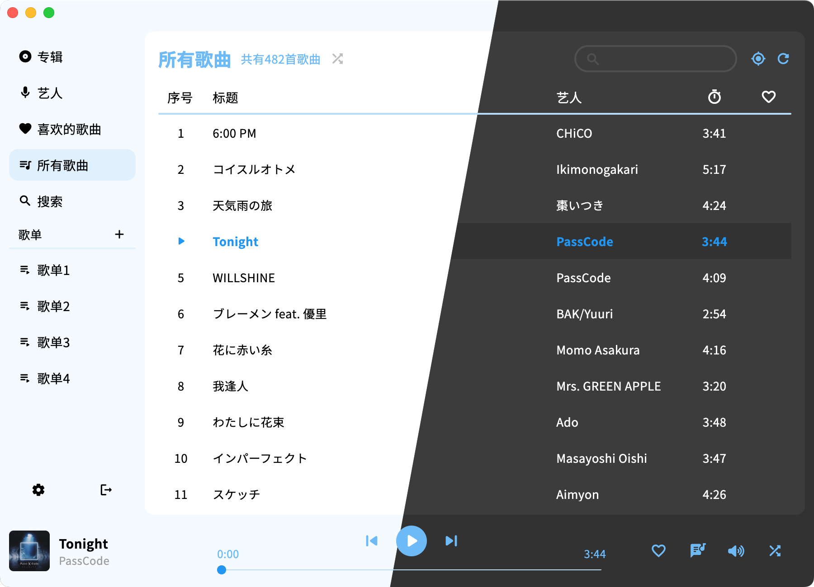
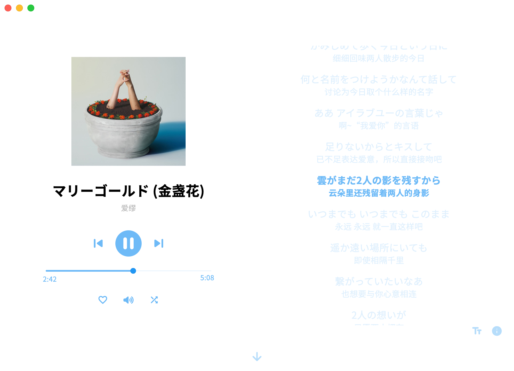

# netPlayer Next

你可以[点击这里](../README.md)查看中文文档

## Intro


This is a Subsonic (Navidrome) API based desktop App. You can [click here](https://www.navidrome.org/docs/installation/) to see how to create a music server with Navidrome (Recommend).

Make sure your device running netPlayer can connect to your music server.


**★ netPlayer Next** | [**netPlayer**](https://github.com/Zhoucheng133/net-player) | [**netPlayer Mobile**](https://github.com/Zhoucheng133/netPlayer-Mobile)

> [!NOTE]
> Notice: This is netPlayer Flutter version starts from v2.0.0

> [!WARNING]
> This version of netPlayer does NOT support Windows 7. If you need netPlayer on Windows7, you should find [v1 netPlayer](https://github.com/Zhoucheng133/net-player)

Desktop Lyric Kit [is here](https://github.com/Zhoucheng133/netPlayer-mini-kit)


\*\* From **v3.2.0**, You can see the detail of multi language support at [**Language support**](#language-support). Other version support Simplified Chinese only.

## Contents

- [Intro](#intro)
- [Usage](#usage)
- [Screenshot](#screenshot)
- [Language support](#language-support)
- [WebSocket service](#websocket-service)
- [FAQ](#faq)
- [Other links](#other-links)
- [Config netPlayer Next on your own device](#config-netplayer-next-on-your-own-device)
- [Some APIs](#some-apis)


## Usage

> [!NOTE]
> Subsonic API does NOT support get 500 songs. All songs you can see is get random 500 songs and sort by time.

> [!TIP]
> You can use full random play button next to song number on all songs page, which is not affected by restrictions of Subsonic API

### Shortcuts

#### Shortcuts in app
- `Space`：Play/Pause
- `command →`(macOS) or `Ctrl →`(Windows)：Next song
- `command ←`(macOS) or `Ctrl ←`(Windows)：Previous song
- `command L`(macOS) or `Ctrl L`(Windows)：Show/Hide lyrics

#### Global shortcuts
- ⏯️(macOS & Windows) or `Ctrl Alt Space`(Windows)：Play/Pause
- ⏩(macOS & Windows) or `Ctrl Alt →`(Windows)：Next song
- ⏪(macOS & Windows) or `Ctrl Alt ←`(Windows)：Previous song

## Screenshot

> [!TIP]
> Customized theme colors & dark mode are now supported!






### Desktop lyric kit

> [!NOTE]
> Desktop lyric kit's code [is here](https://github.com/Zhoucheng133/netPlayer-mini-kit). You can download netPlayer without this feature on Relase page. You can enable it on `Settings - Enable lyric kit`. You need to enable ws service before using it.


## Language support

- Simplified Chinese
- Traditional Chinese (Translated by ChatGPT)
- English (Translated by myself)

You can add your language with pull&request. Here is the language directory: `lib/lang`

If some translate is not accurate, you can add a issue.

## WebSocket service
> [!NOTE]
> This function needs v3.0.0 or later

If you open ws service on **settings**, netPlayer will be a WebSocket server, and it will send messages when lyric update or play song update. The message will be like:

### Send message

```json
{
  "title": <song title>,
  "artist": <song artist>,
  "lyric": <lyric now>,
  "cover": <cover image link>,
  "fullLyric": <full lyric>,
  "line": <line of lyric now>,
  "isPlay": <now playing or not>,
  "mode": <play mode>,
}
```

### Receive message

More details see `lib/views/functions/ws.dart`

```json
{
  "command": <command>
  "data": <data attached>
}
```

Default port of WebSocket server is: `localhost:9098`.

This function can be used for live streaming to display bgm information. You can develop your own live streaming background as follows:
1. Design a web background for your stream.
2. Find a place to display bgm information, and get it through WebSocket service.

## FAQ

### Cannot connect to server
>You need to check whether your cilent device can access to your server. It probably that firewall of your server system blocked your access. Make sure your URL is avaliable (Be aware http and https).
### Not all songs displayed
>Subsonic API does not support to display all the songs. The limit of songs to get is 500.  
But you can shuffle all the songs through "Shuffle all the songs", which is not affect by songs displayed. You can see this button right of the "All" page title.
### See gray block or crashed
>Maybe old version of netPlayer affect  
Delete these directory:   
C:\Users\<your username>\AppData\Roaming\zhouc\net_player_next  
C:\Users\<your username>\AppData\Roaming\zhouc\netPlayer  
### No lyrics found:
>You can see lyrics API at the end of this page. It just what it says.  
Lyrics depends on the song's title, album, artist and duration.
   

## Other links

- [spotify-downloader](https://github.com/spotDL/spotify-downloader) For download songs. It contains songs' informations.
- [Live-BG](https://github.com/Zhoucheng133/Live-BG) Used for live streaming to display bgm information developed by myself.
- [netPlayer-mini-kit](https://github.com/Zhoucheng133/netPlayer-mini-kit)Desktop lyric kit
  
## Config netPlayer Next on your own device

### netPlayer Next only

This project is developed with Flutter 3.29. You can debug with it directly.
Recommand using Visual Studio Code. After installing Flutter and Dart extension on Visual Studio Code, you can debug/profile/relese on your device.

If you Debug or Release on **Windows**, make sure not do it in Chinese mainland network environment.

Build on Windows：
```bash
flutter build windows
```

Build on Mac: 
```bash
flutter build macos
```

### With desktop lyric kit

Use the same way to pacakge [netPlayer-mini-kit](https://github.com/Zhoucheng133/netPlayer-mini-kit), and move it to `<netPlayer program path>/lyric`

### About PR
> [!NOTE]
> If you need to PR, target to branch `dev` instead of branch `main`

Make sure your code does NOT affect other functions!

## Some APIs

[Subsonic API](http://www.subsonic.org/pages/api.jsp)

[lrclib API](https://lrclib.net/docs)